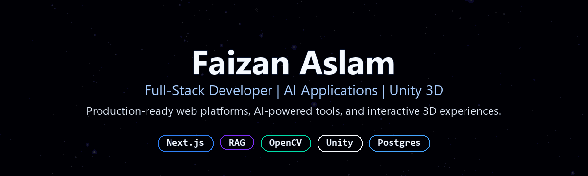

<!-- STARFIELD HEADER -->
<p align="center">
  
</p>

<p align="center">
  <a href="https://github.com/FaizanAslam10">
    
  </a>
  <a href="https://linkedin.com/in/faizan-aslam10">
    
  </a>
  <a href="mailto:m.faizanaslam10@gmail.com">
    
  </a>
  
</p>

<p align="center">
  
</p>

## Transmission: About Me

> Incoming signal from **Lahore, Pakistan**

I'm a Computer Science student and Full-Stack Developer building software that actually ships: AI legal research, RAG pipelines, business websites, e-commerce systems, computer vision tools, and Unity games.

I build products **end to end** - interface, backend, database, authentication, deployment, and polish. From the first commit to the final orbit.

## Constellation of Highlights

- Built **Qanoon**, an AI legal research assistant grounded in **1,000+ Pakistani statutes**
- Implemented RAG pipelines with vector embeddings, semantic search, and Postgres vector storage
- Built a 2D floor plan to 3D visualization workflow using OpenCV and CNN-based recognition
- Shipped full-stack business websites with frontend, backend, database, auth, and deployment
- Built Unity projects including 2D games and ongoing 3D AI-driven gameplay systems

## Missions Launched

| Mission | Objective | Propulsion | Status |
|---|---|---|---|
| **PanjtanPak Developers** | Production website for a real estate and development business | Web Development, Hosting, Deployment | [In Orbit](https://www.panjtanpakdevelopers.com/) |
| **Dreams and Diamonds** | Jewelry e-commerce website with a polished customer-facing storefront | E-commerce, Web Development, Deployment | [In Orbit](https://www.dreamsanddiamonds.org/) |
| **Qanoon** | AI legal research assistant for Pakistani law with cited statute-backed answers | Next.js, RAG, Postgres, Vector Search, Vercel | [In Orbit](https://legal-rag-assistant-two.vercel.app/) |
| **2D Floor Plan to 3D** | Converts residential floor plans into interactive 3D walkthrough visualizations | OpenCV, CNNs, 3D Visualization | [In Orbit](https://fypwebsite-black.vercel.app/) |
| **TradeRank** | Marketing platform for local service businesses with dashboards and lead flows | Next.js, Tailwind CSS, SEO | On Launchpad |
| **Unity Horror Adventure** | Narrative 3D horror game with AI-based enemy behavior | Unity, C# | On Launchpad |
| **2D Coloring Game** | Interactive Unity coloring game | Unity, C# | [In Orbit](https://play.unity.com/en/user/a9058027-8fd6-4b7d-ab87-1042f4cb8055) |

<details>
<summary><strong>Open Mission Control Console</strong></summary>

<br />

```bash
$ ssh faizan@dev-station
> establishing uplink... [OK]
> booting profile.os v2.0... [OK]

PILOT    : Faizan Aslam
STACK    : Next.js | RAG | Unity | OpenCV
DATABASE : Postgres + pgvector
FOCUS    : useful products, clean systems
STATUS   : BUILDING

current trajectory:
- AI legal research tools for Pakistani law
- 2D floor plan -> 3D visualization workflows
- SEO-focused business websites and dashboards
- Unity gameplay systems with AI-driven behavior

signal strength: 100%
```

</details>

<details>
<summary><strong>Crew Log: Experience</strong></summary>

<br />

**Full-Stack Developer - ARK TechnoSolution** `2024 - 2025`
- Built and deployed full-stack web applications from frontend to database
- Integrated APIs, authentication systems, and production-ready deployment flows
- Worked with clients and design teams across the software development lifecycle

**Business Websites & E-Commerce** `2025 - 2026`
- PanjtanPak Developers: production deployment and hosting management
- Dreams and Diamonds: jewelry e-commerce platform under active development

</details>

<details>
<summary><strong>Ask Me About (open comms channel)</strong></summary>

<br />

RAG | Next.js | React | Supabase | Firebase | Postgres | OpenCV | Unity | C# | AI-assisted development | turning raw ideas into deployed products

</details>

<p align="center">
  
</p>

## The Tech Nebula

<h4>Languages</h4>
<p>
  
  
  
  
  
  
  
</p>

<h4>Frameworks & Engines</h4>
<p>
  
  
  
  
  
  
</p>

<h4>Data & Deployment</h4>
<p>
  
  
  
  
  
  
</p>

## Telemetry: GitHub Stats

<p align="center">
  
</p>

<p align="center">
  
</p>

## The Cosmic Snake

<p align="center">
  
</p>

<p align="center">
  
</p>

## Establish Contact

<p align="center">
  <a href="https://linkedin.com/in/faizan-aslam10"></a>
  <a href="https://github.com/FaizanAslam10"></a>
  <a href="mailto:m.faizanaslam10@gmail.com"></a>
</p>

<p align="center">
  <em>From Earth with code - if a mission caught your eye, drop a star. It helps the constellation grow.</em>
</p>

<!-- GALACTIC FOOTER -->


